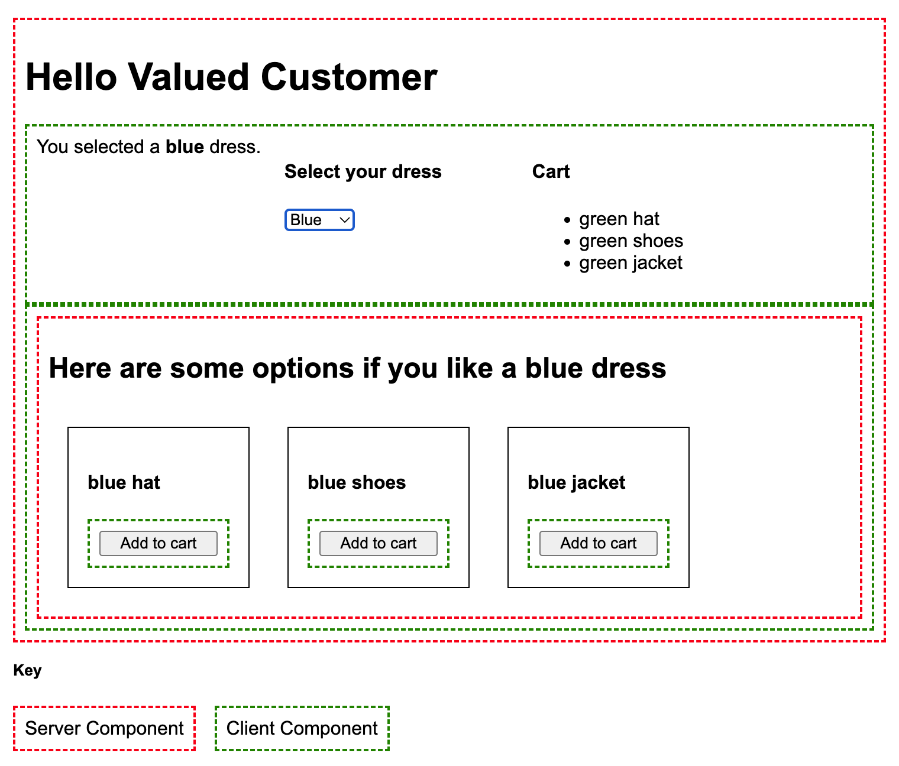

# Server -> Client -> Server -> Client Wakuwork Demo

This project demonstrates how to use the Wakuwork library to demonstrate that interleaving client and server components actually does work, quite well in fact.

In this example the outer layout is rendered by the server. The interactive portion nested within is where the customer selects their dress color and is shown the current contents of the shared global cart.

Within the carousel component, (which is also rendered on the client and listens to the global store for the dress color), is the `ProductCarousel` component that is server rendered. 

That `ProductCarousel` mocks going to a service to make an async request with recommendations. It then renders those recommendations with product cards that include `AddToCart` buttons.

Those `AddToCart` nested buttons are client components that update the global store to add the product to the cart when the customer clicks on them.
